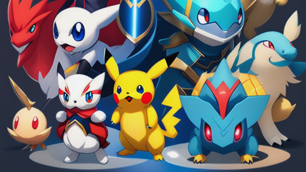
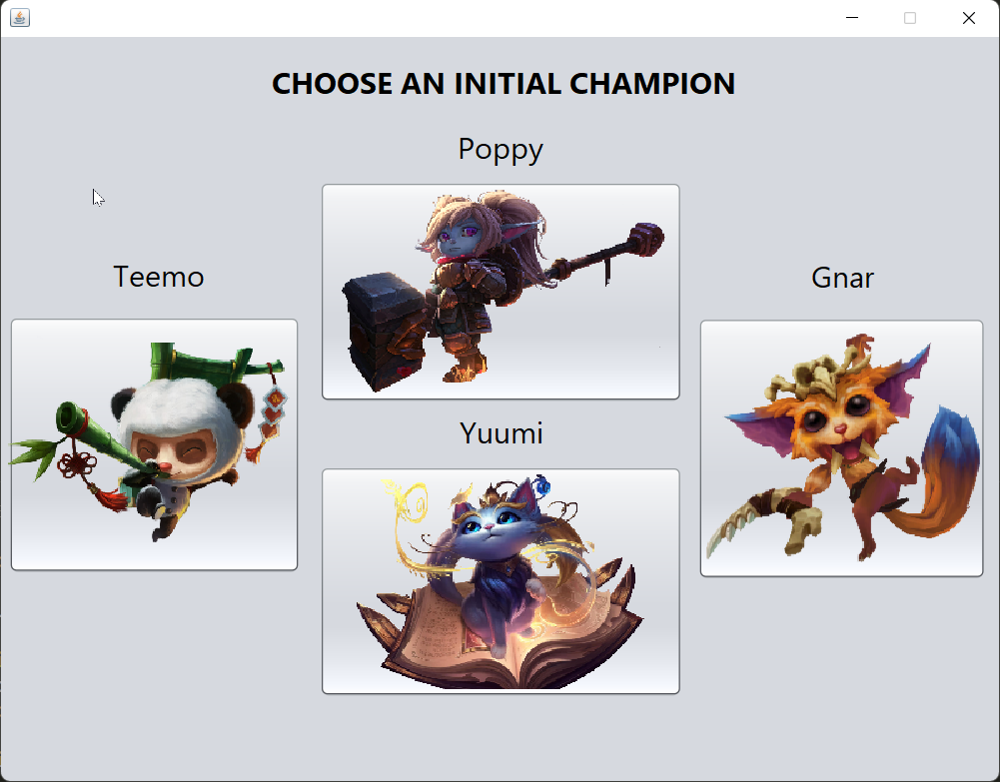
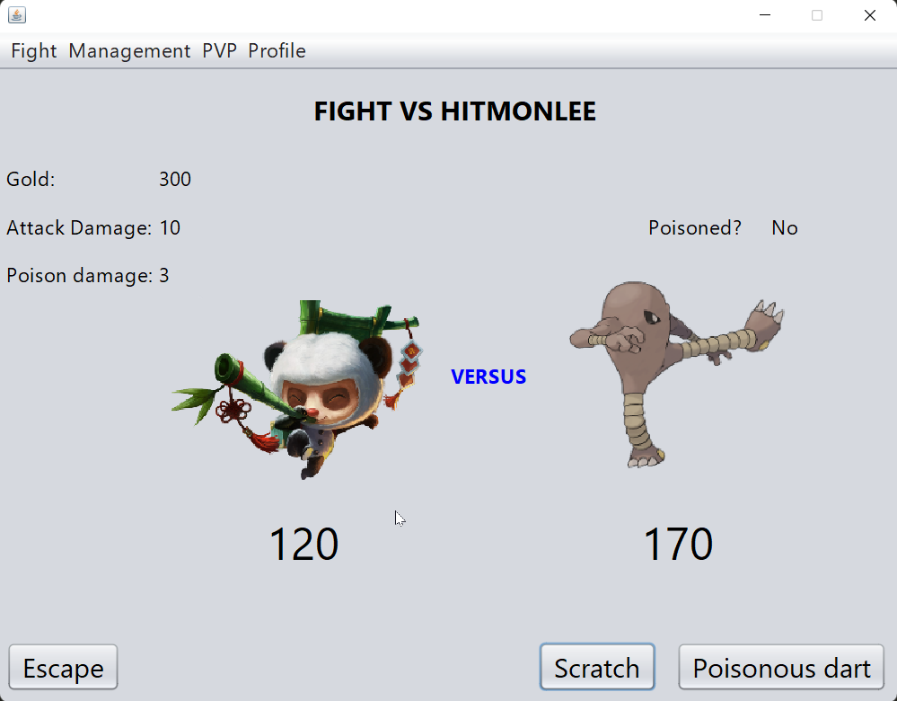
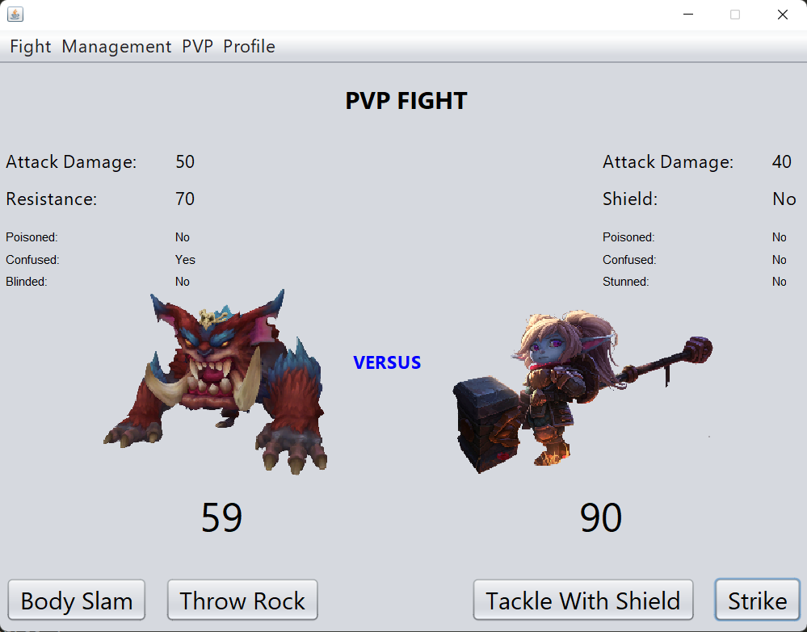
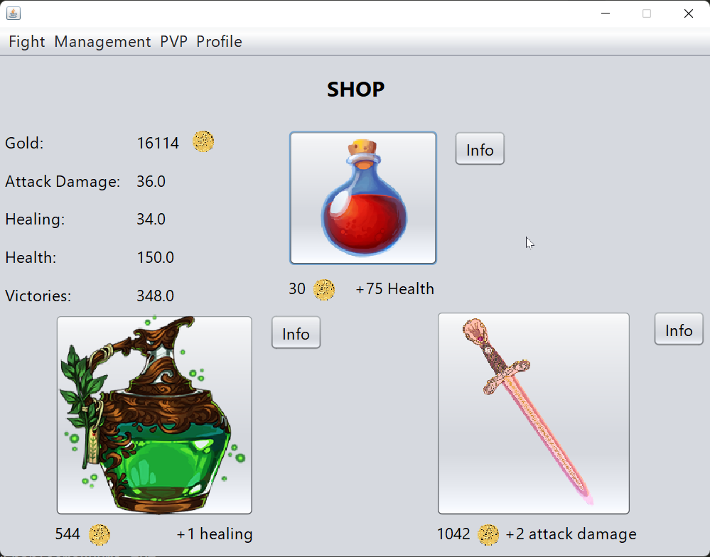
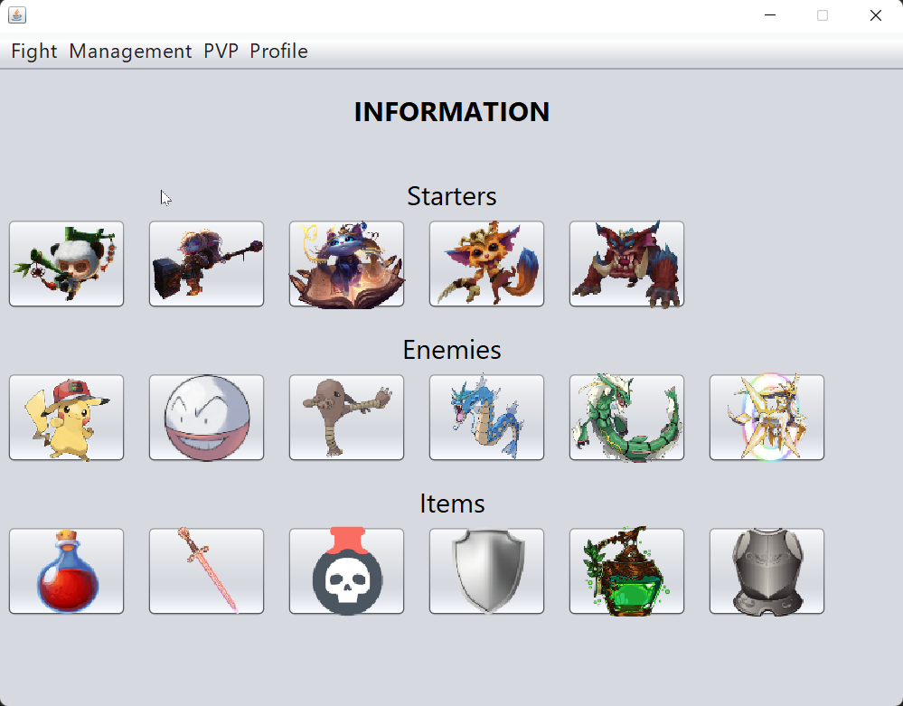

# League of Pokemon
🐾 League of Pokemon is a fun and challenging turn-based game inspired by classic RPGs. Players choose from four possible starters and battle their way through various enemies, unlocking better equipment and other starters along the way. With a built-in PVP feature, you can even battle your friends' starters on the same computer.
[](https://github.com/CosmeValera/LeagueOfPokemon/releases)



## Tech
This game was created with Java Swing, which is Java's implementation for creating GUIs.
### 📦 Prerequisites

- java 14 (or higher)
- Apache Maven (3.6.3 or higher)

### 🚀 Getting Started

To get started with League of Pokemon, you'll need to first compile the source code and then execute it. Here's how:

1. Clone or download the repository to your local machine.

2. Open your terminal and navigate to the root directory of the project.

3. Compile the source code by entering the following command*:

```
javac --enable-preview -source <java version> -cp src/main/java src/main/java/view/GUI.java
```
*Make sure to replace \<java version\> with the Java version installed on your machine. For instance, if you have Java version 17.0.7, you would substitute \<java version\> with 17.

4. Once the code has been compiled successfully, you can execute it by entering the following command:
```
java --enable-preview -cp src/main/java view.GUI
```
Now you are all set :), if everything went right you should be seeing this:



### 🧪 Tests
To run the automated tests for League of Pokemon, use the following command:
```
mvn test
```
This command compiles and runs all the unit tests in the project using Apache Maven.

### 👥 Contributing
Pull requests are welcome. For major changes, please open an issue first to discuss what you would like to change.

## Images (GUI)
- Choose an Initial Champion

- Fight

- PVP Fight

- Shop

- Information
